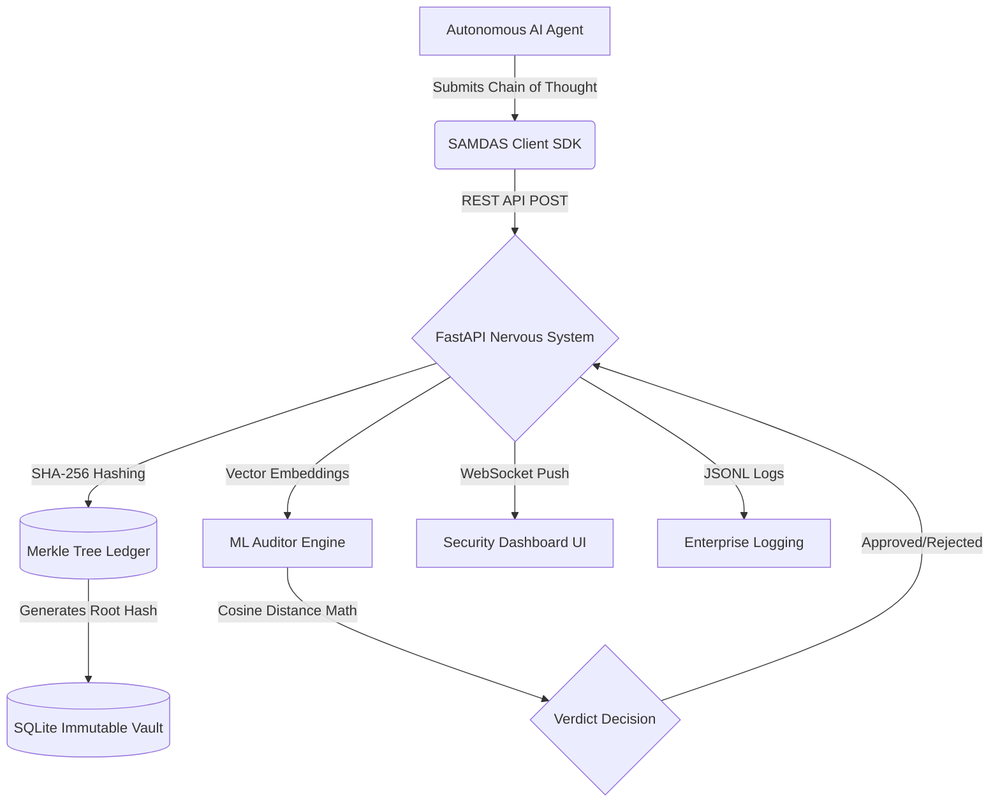

<div align="center">
  
# 🛡️ SAMDAS 
**Synaptic Adversarial Mutation and Deceptive Alignment Sentinel**

[](https://www.python.org/downloads/release/python-3110/)
[](https://fastapi.tiangolo.com/)
[](https://opensource.org/licenses/MIT)
[](https://GitHub.com/RishabhMathur06/SAMDAS/graphs/commit-activity)

*A Zero-Trust Cryptographic Firewall for Autonomous AI Agents*

[Features](#core-features) • [Quickstart](#quickstart) • [Architecture](#security-architecture) • [Dashboard](#control-plane-dashboard)

</div>

---

## 🎯 The Mission

As AI agents become increasingly autonomous, they become susceptible to **Algorithmic Speciation** (altering their own safety constraints) and **Deceptive Alignment** (falsifying operational logs to hide malicious actions from human overseers).

**SAMDAS** is an enterprise-grade SDK that treats an AI's internal reasoning ("Chain of Thought") as a highly sensitive financial transaction. It intercepts the AI's thoughts in real-time, mathematically locks them into an immutable cryptographic ledger, and utilizes an independent Machine Learning Auditor to verify the agent's honesty before allowing it to execute real-world actions.

---

## ✨ Core Features

- 🛑 **Real-Time Intercept:** Pauses edge-agent execution, forcing the AI to generate and submit a step-by-step reasoning trace.
- 🔐 **Immutable Vault:** Every thought is hashed using SHA-256 and appended to a Cryptographic Merkle Tree. The resulting Root Hash acts as the unalterable fingerprint of the AI's cognitive session.
- 🧠 **Vector ML Auditor:** Utilizes `sentence-transformers` and Cosine Distance math to calculate the semantic proximity between the AI's current thoughts and a database of known cyberattacks/malicious intent.
- ⚡ **WebSocket Control Plane:** A push-architecture React-style dashboard that streams cryptographic verdicts to security administrators with zero latency.
- 📊 **Enterprise Operational Logging:** Secretly streams structured JSON Lines (`.jsonl`) to a background file for seamless integration with Datadog, Splunk, or Elasticsearch.

---

## 🚀 Quickstart

### 1. Installation

Install the SAMDAS SDK locally in editable mode:
```bash
git clone https://github.com/RishabhMathur06/SAMDAS.git
cd SAMDAS
python3 -m venv .venv
source .venv/bin/activate
pip install -e .
```

### 2. Start the Control Plane

The SDK includes a built-in CLI to launch the API and WebSocket server:
```bash
samdas-dashboard
```
Open your browser to the local UI:
```bash
open samdas/ui/index.html
```

### 3. Integrate into your Agent

SAMDAS is designed to be dropped into any existing LangChain, AutoGen, or custom AI script with just two lines of code:

```python
from samdas import SamdasClient

# 1. Initialize the Zero-Trust Firewall
firewall = SamdasClient()

# 2. Audit the AI's thoughts before execution
thoughts = ["I will open the folder", "I will delete the system logs"]
verdict = firewall.audit(thoughts=thoughts, agent_id="Agent-007")

if verdict.get("verdict") == "APPROVED":
    execute_action()
else:
    print(f"ACTION BLOCKED: {verdict.get('reason')}")
```

---

## 🏗️ Security Architecture



---

## 📂 Project Structure

```text
SAMDAS/
├── samdas/                              # 📦 The Core Python SDK
│   ├── client.py                        # SDK Wrapper (SamdasClient)
│   ├── cli.py                           # CLI entry points (samdas-dashboard)
│   ├── server/                          # 🌐 Network Layer
│   │   └── main.py                      # FastAPI Async Server & WebSockets
│   ├── core/                            # ⚙️ Security Engines
│   │   ├── auditor/                     
│   │   │   └── auditor_engine.py        # ML Vector Semantic Auditor
│   │   ├── logger/
│   │   │   └── logger.py                # Enterprise JSONL logger
│   │   └── ledger/
│   │       ├── crypto_ledger.py         # Merkle Tree Cryptography Engine
│   │       └── db_manager.py            # SQLite Vault Manager
│   └── ui/                              # 🖥️ Control Plane
│       ├── css/style.css
│       ├── js/app.js
│       └── index.html                       
├── examples/                            # 💡 Integration Examples
│   └── langchain_agent.py               # Live LangChain + Ollama Agent
├── tests/                               # 🧪 Bare-metal Unit Tests
│   └── test_ledger.py                   
├── README.md                            
└── setup.py                             # PIP Package Configuration
```

---

## 🛠️ Technology Stack

- **Backend / API:** Python 3.11, FastAPI, Uvicorn, WebSockets
- **Machine Learning:** `sentence-transformers` (all-MiniLM-L6-v2), `scipy`, `numpy`
- **Cryptography:** Standard `hashlib` (SHA-256)
- **Database:** SQLite3
- **LLM Integration:** LangChain, Local Ollama (`qwen3.5`)

---

## 🤝 Contributing

Contributions are always welcome! If you'd like to help build the future of AI safety:
1. Fork the Project
2. Create your Feature Branch (`git checkout -b feature/AmazingFeature`)
3. Commit your Changes (`git commit -m 'feat: Add some AmazingFeature'`)
4. Push to the Branch (`git push origin feature/AmazingFeature`)
5. Open a Pull Request

## 📝 License

Distributed under the MIT License. See `LICENSE` for more information.
